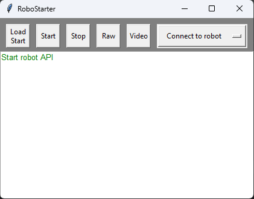

# О содержании FE2023 гита
1) В папке  хранятся все модели, которые я использовал для своей машинки. В файле  находится 3д модель 2 этажа на моём роботе, где находятся все электрические схемы и компоненты

2) В папке  в данной папке хранится  txt документ , в котором находится ссылка на видео на площадке ютуб. В видео есть проезд машинки квалификацию, финал и рассказ о строение робота.

3) В папке  хранятся все нужные файлы для запуска машинки. Подробнее в 

4) В папке  находятся три документа, в них рассмотрено устройство робота и логика прохождения трассы.
  
5) В папке  находятся семь фотографий, из них шесть фотографий робота с разных ракурсов и одна фотогрфия команды.

# Пояснения к программам
Здесь находится краткий разбор программ, которые я использую для робота.
1)  - в этом файле содержится класс для работы робота с камерой. Робот считывант изображение с камеры и работает с ним.
2)  - этот файл нужен для raspberry pi, чтобы при включении машинки сразу запускалась программа.
3)  - этот файл нужен для прошивки ARDUINO.
4)  и  - эти файлы говорят сами за себя. Строение этих фалов достаточно лёгкое. Основная программа - это kvalifikacia.py. В final.py добавляется распознование и объезд знаков. Вся их работа делится на этапы:
- Ожидание кнопки - программа ждёт кнопку и скорость = 0
- Движение - в kvalifikacia.py робот смотри бортики и линии и по ним едит, а в final.py добавляется распознование знаков и их объезд.
- Остановка - когда робот насчитает 12 пер (это количество линий, которые он проехал оранжевые или синие) он останавливается
5)  - в этом файле приложение, при запуске этого файла открывается окошко подключения к raspberry pi(raspberry раздаёт WI-FI сеть) и с помощью этого файла можно загружать файлы final.py или kvalifikacia.py, а также autostart.py

# Загрузка программы на ARDUINO
Здесь я описываю как прошиться плату ARDUINO UNO.
1) Чтобы прошить ARDUINO UNO надо скачать приложение Arduino IDE и установить.
2) После установление приложения надо подключить плату ARDUINO UNO к компьютеру и с помощьюю файла  прошить плату. После этих действий переходим к raspberry.

# Загрузка программы на raspberry pi
Здесь я описываю как прошиться raspberry pi.
1) Для того чтобы raspberry работало, надо вытащить карту памяти из raspberry и подключить её к компьютеру. После этого устанавливаем систему и раздаём сеть от raspberry.
2) В папке  есть файл  и именно он помогает подключиться к raspberry и загрузить прогрумму.
- Ниже приведён скримок экрана start_robot.py и объяснение кнопок
- 
- В нём мы видим кнопки: LoadStart, Start, Stop, Raw, Video, Connect to robot. Я расскажу про каждую из кнопок и как её использовать.
1. Кнопка LoadStart нужна для быстрой загрузки файла final.py или kvalifikacia.py, а также для загрузки файла autostart.py, которые автоматически запускает указанные файлы.
2. Кнопка Start нужна для уже загруженного файла, чтобы его перезапустить или перезапустить с изменениями.
3. Кнопка Stop останавливает прогрумму и робот перестаёт ехать.
4. Кнопка Raw это настройка формата изображения.
5. Кнопка Video включает видео с камеры машины.
6. Кнопка Connect to robot это подключение к роботу.
- Инструкция к загрузке файла на raspberry pi:
1. Подключаемся к сети робота, в моём случае "Racer2".
2. Потом нажимаем на кнопку "Connect to robot" и подключаемся с помощью приложения к роботу.
3. После подключения нажимаем кнопку "LoadStart" и загружаем нужную нам прогрумму.
4. Нажимаем на кнопку "Video", в отдельном окне появляется видео с робота.
5. Нажимаем кнопку на роботе и всё готово, робот должен поехать.
